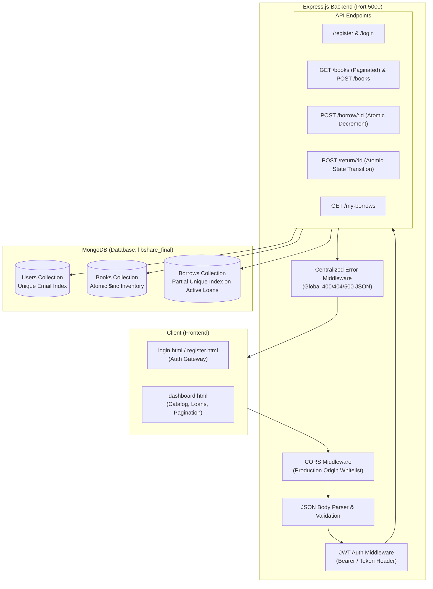
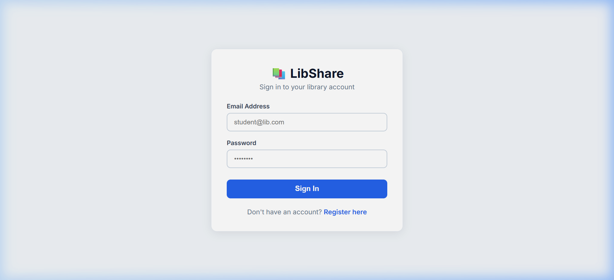
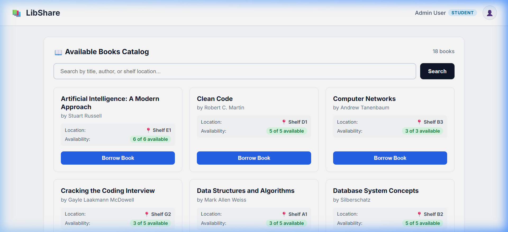
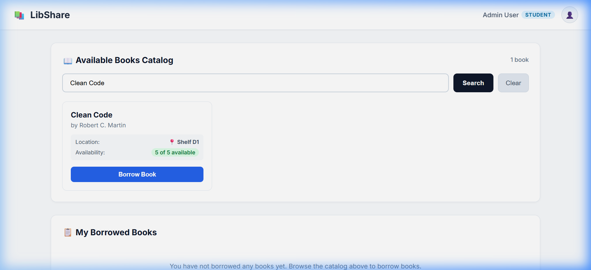
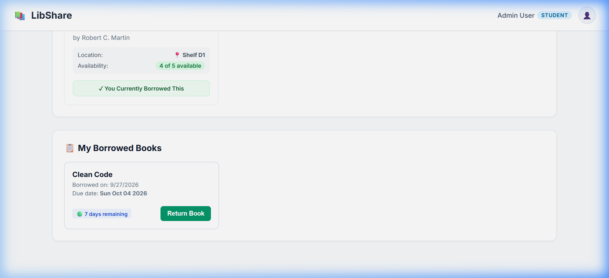
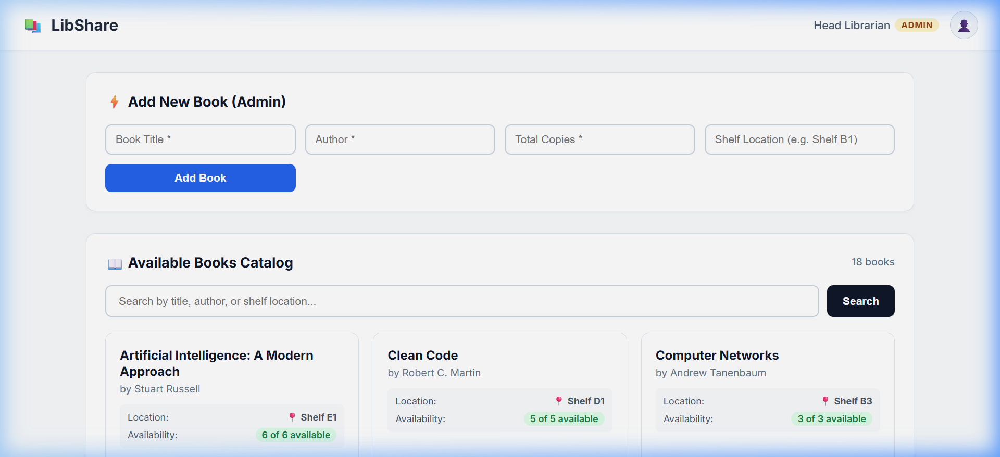

# 📚 LibShare - Library Management & Book Sharing Platform

LibShare is a full-stack library management and book sharing platform built with **Node.js, Express, MongoDB, and modern Vanilla Web Technologies**. It provides robust role-based access control, book catalog browsing, inventory tracking, and concurrency-hardened loan and return operations.

---

## 🏗️ System Architecture



---

## 🛡️ Concurrency & Edge-Case Protection

LibShare solves classic database race conditions using database-level atomic operations and compound partial indexes:

| Scenario / Edge Case | Problem in Naive Systems | LibShare Concurrency Solution |
| :--- | :--- | :--- |
| **Two Users Borrow Last Remaining Copy (1 left)** | Both read `availableCopies = 1`, pass check, and both decrement, creating negative inventory or phantom loans. | **Atomic `findOneAndUpdate`**: `{ _id: bookId, availableCopies: { $gt: 0 } }, { $inc: { availableCopies: -1 } }`. MongoDB guarantees atomic row execution—exactly 1 user succeeds; the other is rejected with `400 Out of Stock`. |
| **Same User Simultaneous Multi-Clicks** | A student rapidly double-clicks "Borrow", creating 2 duplicate loan records. | **Database Partial Unique Index**: `{ userId: 1, bookId: 1 }` where `{ returned: false }`. Even if simultaneous requests arrive at the exact same millisecond, MongoDB rejects the duplicate insert, triggers a rollback, and returns a clean error. |
| **Double-Return Attempt** | Returning an already returned loan (consecutively or concurrently) increments `availableCopies` multiple times, inflating inventory. | **Atomic State Transition**: `Borrow.findOneAndUpdate({ _id: id, returned: false }, { $set: { returned: true } })`. Only one transition succeeds; subsequent attempts return `400 Already returned` and copy count is never touched. |
| **Borrow → Return → Borrow Lifecycle** | User borrows a book, returns it, and borrows it again later. | The partial unique index only applies to active loans (`returned: false`). Once returned, the user can borrow the title again, with all previous history intact. |
| **Search ReDoS & Special Character Crash** | Searching with regex special characters like `(`, `[`, `*`, `\` crashes MongoDB regex parser with a 500. | Safe regex escaping utility sanitizes search queries before querying `title`, `author`, and `location`. |

---

## 📸 Screenshots & Visual Walkthrough

### 1. User Authentication & Login
Clean sign-in interface with inline validation, Enter-key submission, and session preservation.


### 2. Available Books Catalog & Pagination
Browse catalog items with title, author, shelf location, availability pills, and pagination controls.


### 3. Real-Time Search & Shelf Filtering
Filter books dynamically across Title, Author, or Shelf Location with instant clear controls.


### 4. Active Loans & One-Click Return
Track due dates (+7 days), overdue indicators, and return borrowed books with instant inventory restoration.


### 5. Role-Based Admin Management
Admins can register new titles with title, author, total copies, and shelf locations.


---

## ⚙️ Automated Test Suite

LibShare includes a comprehensive automated test suite built with Node.js native testing and assertion libraries (zero external test dependencies required).

### Running Tests

```bash
cd backend
npm test
```

### Test Coverage Summary (15/15 Passed)

- **Input Validation**:
  - `• Registration rejects invalid email format`
  - `• Registration rejects short password (< 4 chars)`
  - `• Registration successfully creates student account`
  - `• Registration rejects duplicate email`
  - `• Login with wrong password returns 400 Bad Request`
  - `• Login with correct credentials returns 200 OK and JWT`
- **Catalog & Pagination**:
  - `• GET /books returns paginated structure with metadata`
  - `• GET /books search handles regex special characters safely`
- **Concurrency & Race Conditions**:
  - `• Multi-user concurrent borrow on last copy (exactly 1 succeeds, copies = 0)`
  - `• Same-user simultaneous borrow (duplicate concurrent loan rejected)`
  - `• Double-return test (prevents duplicate copy inflation)`
  - `• Borrow → Return → Borrow lifecycle verification`
- **Error Handling & Middleware**:
  - `• 404 handler returns structured JSON on non-existent route`
  - `• Borrow with invalid ObjectId format returns 400 Bad Request`
  - `• Return with invalid ObjectId format returns 400 Bad Request`

---

## 📡 API Reference

### Authentication Endpoints

| Method | Endpoint | Description | Auth Required |
| :--- | :--- | :--- | :--- |
| `POST` | `/register` | Register student or admin account | No |
| `POST` | `/login` | Authenticate user and receive JWT | No |

### Book Catalog Endpoints

| Method | Endpoint | Query / Body Params | Auth Required | Description |
| :--- | :--- | :--- | :--- | :--- |
| `GET` | `/books` | `page`, `limit`, `search` | No | Returns paginated catalog list |
| `POST` | `/books` | `title`, `author`, `totalCopies`, `location` | Yes (Admin) | Add a new book to catalog |

### Borrowing & Return Endpoints

| Method | Endpoint | Description | Auth Required |
| :--- | :--- | :--- | :--- |
| `POST` | `/borrow/:id` | Borrow book copy (Atomic decrement) | Yes (Student / Admin) |
| `POST` | `/return/:id` | Return book copy (Atomic increment) | Yes (Student / Admin) |
| `GET` | `/my-borrows` | List current user loan history | Yes (Student / Admin) |

---

## 🚀 Setup & Local Execution

### Prerequisites
- **Node.js** (v18+ or v24+ recommended)
- **MongoDB** running locally on `mongodb://127.0.0.1:27017`

### 1. Start the Backend Server

```bash
cd backend
npm install
npm start
```
*The server will start on port `5000` and automatically seed initial books from `books.json` if the database is empty.*

### 2. Open the Frontend

Simply open any of the following HTML files in your browser:
- Open `frontend/login.html` to log in or register.
- Open `frontend/index.html` for automatic auth-based routing.
- Open `frontend/dashboard.html` to view the library dashboard.

### 3. Environment Variables (Optional)

Configure custom ports or database connection strings via environment variables:

```env
PORT=5000
MONGO_URI=mongodb://127.0.0.1:27017/libshare_final
JWT_SECRET=libshare_secret
NODE_ENV=production
ALLOWED_ORIGINS=http://localhost:3000,http://localhost:5000
```
